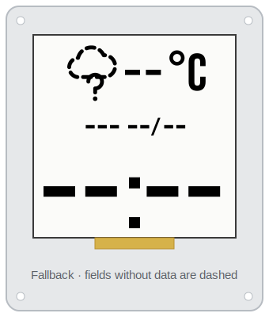

# espaperclock

ESP8266 firmware (PlatformIO/Arduino) for a 1.54" e-paper clock. Shows a 24h
digital clock (NTP, configured timezone) and the current weather — condition
icon + temperature in °C — from the OpenWeatherMap *Current Weather* API.

> **Status:** the panel hasn't arrived. WiFi provisioning, settings and OTA are
> done; nothing is drawn yet and `GxEPD2` / `Adafruit GFX` are out of
> `platformio.ini`.

## Display layout

| Normal | Fallback |
|:---:|:---:|
|  |  |

| Element | Content | Example | Fallback |
|---|---|---|---|
| Time | 24h `HH:MM`, the largest element | `14:37` | `--:--` |
| Temperature | current temp in °C, next to the weather icon | `18°C` | `--°C` |
| Date | weekday + `dd/mm` | `QUA 22/07` | `--- --/--` |

Each area degrades on its own — the fallback mockup is the worst case, not a
screen drawn as a whole. Weather falls back when OpenWeather fails; time and
date fall back only on a never-synced board (no NTP, no RTC), rather than
showing a plausible wrong time.

The mockup uses Bebas Neue; on-device that maps to a bitmap/GFX big font.

## Hardware

Waveshare 1.54" e-Paper (V2) — 200×200 monochrome `SSD1681`, partial refresh —
on a LOLIN `d1_mini_pro` (v2).

| E-paper | D1 mini Pro | GPIO |
|---|---|---|
| BUSY | D2 | GPIO4  |
| RST  | D4 | GPIO2  |
| DC   | D3 | GPIO0  |
| CS   | D8 | GPIO15 |
| CLK (SCK)  | D5 | GPIO14 |
| DIN (MOSI) | D7 | GPIO13 |
| GND  | G   | GND |
| 3.3V | 3V3 | 3.3V |

- [D1 mini Pro pinout](https://www.wemos.cc/en/latest/d1/d1_mini_pro.html)
- [Waveshare 1.54" e-Paper — ESP32/8266 wiring](https://www.waveshare.com/wiki/1.54inch_e-Paper_Module_Manual#ESP32.2F8266)

## HTTP endpoints

| Endpoint  | Method | Auth | Description                              |
|-----------|--------|------|------------------------------------------|
| `/health` | GET    | none | Liveness check; returns status and datetime. |

## Weather

OpenWeather *Current Weather Data*:

```
http://api.openweathermap.org/data/2.5/weather?q=Juiz%20de%20Fora,BR&units=metric&appid=<API_KEY>
```

Response fields used: `main.temp`, `weather[0].icon` / `weather[0].id` (icon
mapping), `weather[0].description`.

Fetch tuning stays in `platformio.ini` `build_flags` — `OWM_HTTP_TIMEOUT_MS`
and `OWM_REFRESH_INTERVAL_MS` are firmware tunables, not user settings.

## TODO

1. [ ] Migrate all code to ESP32.
2. [ ] Deep sleep with NTP sync every 24h.
3. [ ] Display: partial refresh only; full refresh after NTP sync.
4. [ ] Run on the 600 mAh JST LiPo.
5. [ ] Retry the OpenWeather request on failure.
6. [ ] Cache the weather result (RTC memory) across deep sleep.
7. [ ] Move the OpenWeather URL into config.
8. [ ] Use HTTPS for the OpenWeather request.
