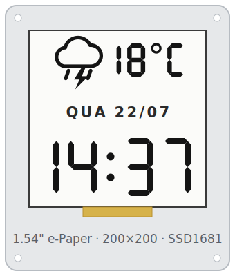

# espaperclock

ESP8266 firmware (PlatformIO/Arduino) for a 1.54" e-paper clock. Shows a 24h
digital clock (NTP, configured timezone) and the current weather — condition
icon + temperature in °C — from the OpenWeatherMap *Current Weather* API.

> **Status:** the panel hasn't arrived. WiFi provisioning, settings and OTA are
> done; nothing is drawn yet and `GxEPD2` / `Adafruit GFX` are out of
> `platformio.ini`.

## Display layout



| Element | Content | Example |
|---|---|---|
| Time | 24h `HH:MM`, the largest element | `14:37` |
| Temperature | current temp in °C, next to the weather icon | `18°C` |
| Date | weekday + `dd/mm` | `QUA 22/07` |

The mockup uses Bebas Neue; on-device that maps to a bitmap/GFX big font.

## Hardware

Waveshare 1.54" e-Paper (V2) — 200×200 monochrome `SSD1681`, partial refresh —
on a LOLIN `d1_mini_pro` (v2).

| E-paper | D1 mini Pro | GPIO |
|---|---|---|
| BUSY | D2 | GPIO4  |
| RST  | D4 | GPIO2  |
| DC   | D3 | GPIO0  |
| CS   | D8 | GPIO15 |
| CLK (SCK)  | D5 | GPIO14 |
| DIN (MOSI) | D7 | GPIO13 |
| GND  | G   | GND |
| 3.3V | 3V3 | 3.3V |

- [D1 mini Pro pinout](https://www.wemos.cc/en/latest/d1/d1_mini_pro.html)
- [Waveshare 1.54" e-Paper — ESP32/8266 wiring](https://www.waveshare.com/wiki/1.54inch_e-Paper_Module_Manual#ESP32.2F8266)

## Weather

OpenWeather *Current Weather Data* (not One Call 3.0):

```
https://api.openweathermap.org/data/2.5/weather?q=Juiz%20de%20Fora,BR&units=metric&appid=<API_KEY>
```

Response fields used: `main.temp`, `weather[0].icon` / `weather[0].id` (icon
mapping), `weather[0].description`.

## TODO

- [ ] Re-add `GxEPD2` + `Adafruit GFX` and bring up the 1.54" panel.
- [x] WiFi provisioning via a `wifi_setup` module (WiFiManager captive portal),
      based on the reference project. Portal custom config: OpenWeather API key,
      weather city/country (default `Juiz de Fora,BR`), and clock timezone
      (default `America/Sao_Paulo`).
- [ ] NTP time sync (default `America/Sao_Paulo`).
- [ ] OpenWeatherMap fetch for Juiz de Fora (icon + °C), with a fallback when
      the data can't be retrieved (no WiFi / API error) — the clock must keep
      running, only the weather area degrades (stale/placeholder).
- [ ] Partial-refresh rendering of the time, date (weekday + dd/mm) and weather;
      periodic full refresh.
- [ ] Add JST battery (LiPo) for portable power.
- [ ] Add an RTC to keep time without WiFi — RobotDyn DS1307 shield for D1 mini
      (I2C).
- [ ] Measure local temperature with an SHT30 sensor (I2C).
- [ ] Deep sleep to save battery (wake on timer, update, sleep; needs
      `D0`/`GPIO16` wired to `RST`).
